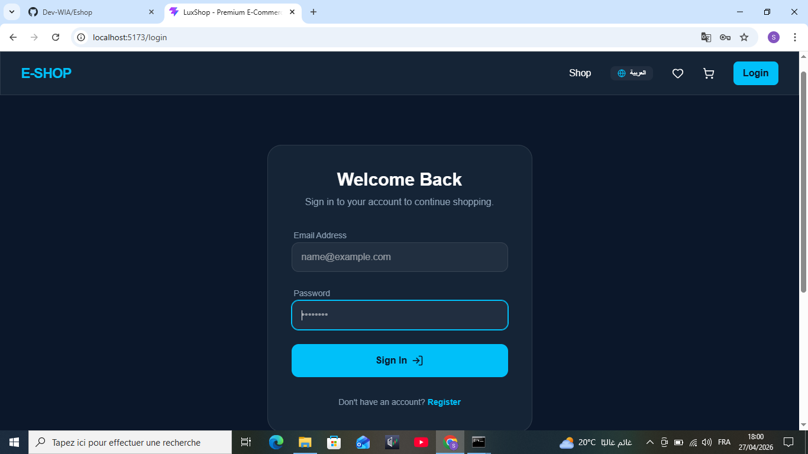
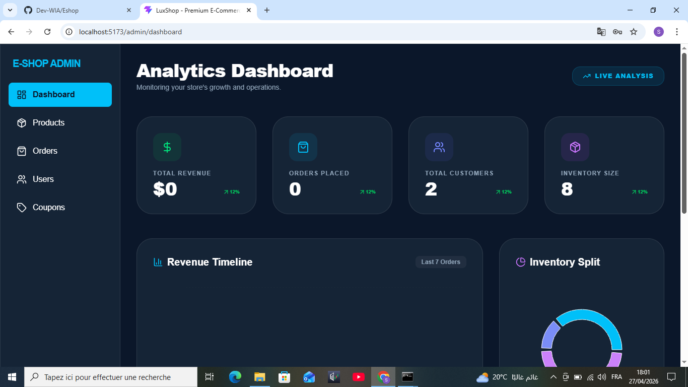

# LuxShop - Premium Full-Stack E-Commerce 🚀

A state-of-the-art, production-ready E-commerce platform built with the modern MERN stack.

.png)
.png)




## 🌟 Key Features
- **Frontend**: React 19, Vite 6, Tailwind CSS v4, Framer Motion, Recharts.
- **Backend**: Node.js, Express, MongoDB (Mongoose).
- **Internationalization**: Full Arabic (RTL) and English (LTR) support.
- **Payments**: Integrated Stripe Checkout & Webhooks.
- **Media**: Cloudinary image management.
- **PWA**: Mobile installable with offline capabilities.
- **Admin**: Advanced dashboard with real-time analytics and marketing (coupons).

## 🛠️ Setup Instructions

### 1. Prerequisites
- Node.js (v18+)
- MongoDB (Local or Atlas)
- Stripe & Cloudinary Accounts

### 2. Backend Setup
```bash
cd backend
npm install
```
Create a `.env` file in the `backend` directory:
```env
PORT=5000
MONGO_URI=your_mongodb_uri
JWT_SECRET=your_jwt_secret
STRIPE_SECRET_KEY=your_stripe_key
STRIPE_WEBHOOK_SECRET=your_webhook_secret
CLOUDINARY_CLOUD_NAME=your_name
CLOUDINARY_API_KEY=your_key
CLOUDINARY_API_SECRET=your_secret
SMTP_HOST=smtp.gmail.com
SMTP_PORT=587
SMTP_USER=your_email
SMTP_PASS=your_app_password
FROM_EMAIL=noreply@luxshop.com
FROM_NAME=LuxShop
```
**Seed the database**:
```bash
npm run data:import
```

### 3. Frontend Setup
```bash
cd frontend
npm install
```
Create a `.env` file in the `frontend` directory:
```env
VITE_API_URL=http://localhost:5000
```

### 4. Run the Application
**Start Backend**:
```bash
cd backend
npm run dev
```
**Start Frontend**:
```bash
cd frontend
npm run dev
```

## 🔐 Credentials (After Seeding)
- **Admin**: `admin@example.com` / `password123`
- **Customer**: `john@example.com` / `password123`

---
Built with ❤️ by your AI Senior Engineer.
